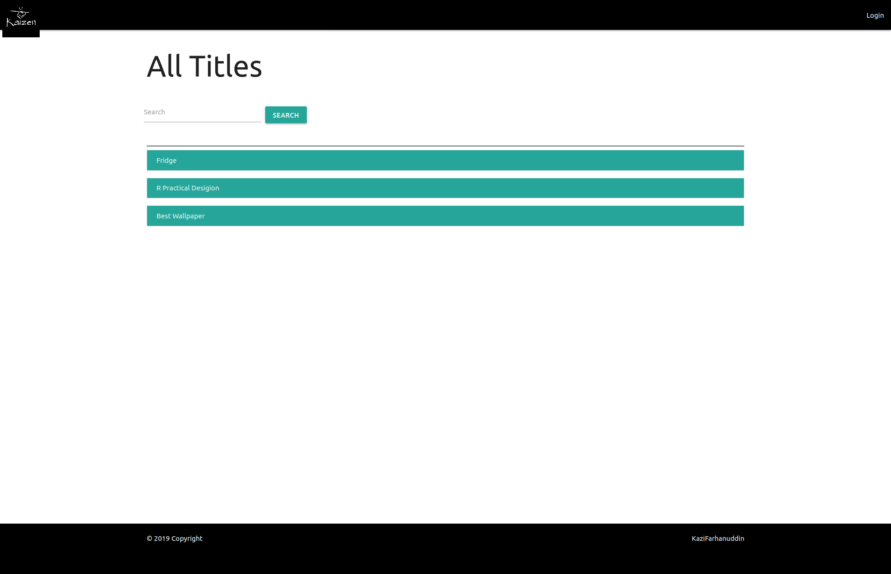
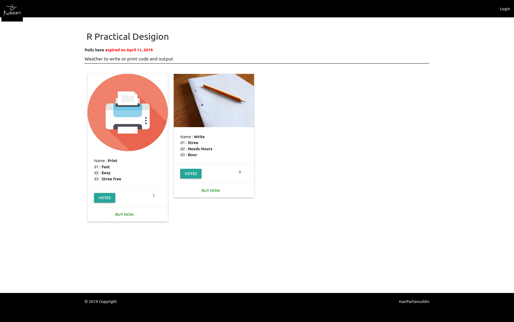

# kaizenvote


On Kaizenvote you can create you own polls on any topic you like, Kizenvote also  tracks the IP of the vote caster, so as to not allow one user to cast more than one vote, making it more robust without the vote caster needing to revel his/her identity  





## Run Instructions

1. Install dependencies
   `pip install -r requirements.txt`
2. run command 
   `python manage.py runserver`
3. Go to 127.0.0.1:8000

You don't need to go into admin panel for this project but if you need/want to you can 

1. create a superuser using
   ` python manage.py createsuperuser`
2. and login at 
   ` 127.0.0.1:8000/admin `

#### Using docker

1. Run it
    `docker-compose up`

To enable password reset, enter your email credentials in 'env_email.env' file, then run using the above command   

## Docker image

https://hub.docker.com/r/kazifarhan199/kaizenvote


## Dependency

1. django
2. django-braces
   

## File Structure

```
├── README.md - a markdown file about this repo
├── requirements.txt - a requirements file containg all dependencies
├── docs - directory containg resources used in README.md
├── Procfile - file for use at heroku for the deployed instance
├── VootingWebsite - the main project directory 
├── Accounts - the app handelling accounts
├── Title - the app handelling title (polls)
├── Options - the app handelling optiosns
├── Voots - the app handelling vote interactions and tracking
├── staticfile - directory containing project static files
```

## Description

In project Each poll is called a title

The main project is divided into 4 main apps

1. Accounts

   This app is responsible for all user related stuff like login/logout, signup, etc

2. Title (poll)
   This has under it options, This app contains all poll, creation, edit and delete related stuff, including deciding the time limit till the poll.

3. Options
   These are option of a particular title(option), this app contains all option related stuff

4. Voots
   This app is responsible to track voters IP and manage all interaction related to voters on the website

## Motivation

Doesn't the sound of a website where you can create you own polls and cast votes anonymously sound cool, well off cause it does, so that is what my motivation has been.

Inside story, in my github profile you might be able to find another, voting website, I created it earlier, but when I asked some people to use it, on one did, one of them told me to make it allow anonymous voting, that is what was actually my motivation for this one. You can say this project is like a phoenix that rose from the ashes of the previous project.

## License

This project is under the MIT License


